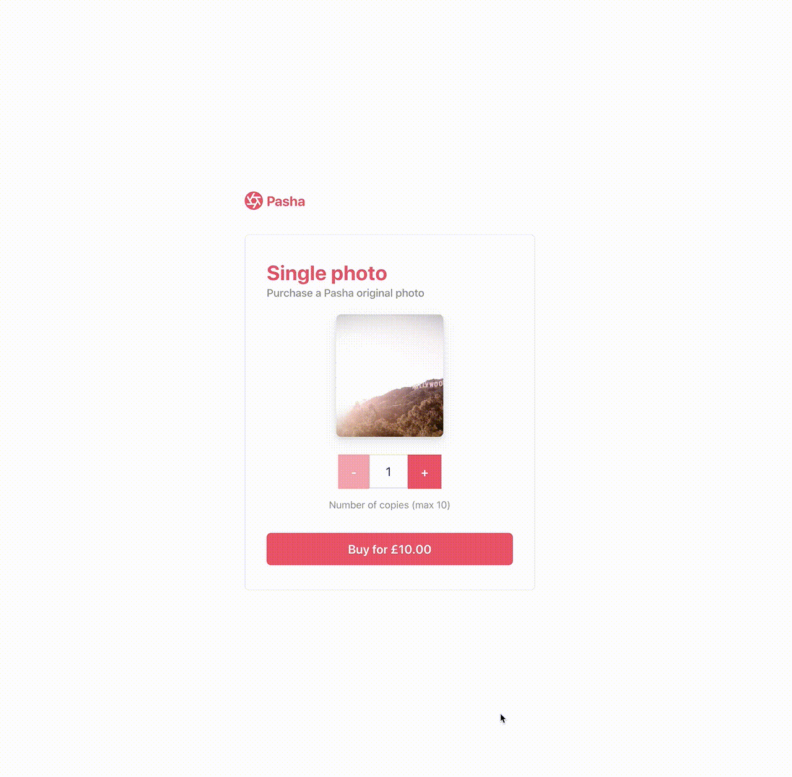

# Setup a Bacs Direct Debit and accept a payment

Building a payment form UI from scratch is difficult -- input field validation, error message handing, and localization are just a few things to think about when designing a simple checkout flow.

We built [Checkout](https://stripe.com/docs/payments/checkout) to do that work for you so now you can focus on building the best storefront experience for your customers.

Now you can also use Checkout to accept payments using Bacs Direct Debit.

## Demo

<details open><summary>Bacs Direct Debit with payment</summary>

</details>

- [Node](https://b17if.sse.codesandbox.io/)
- [Fork on CodeSandbox](https://codesandbox.io/s/checkout-uk-bacs-debit-setup-and-payment-b17if) The demo is running in test mode -- use `10-88-00` as a sort code, and `00012345` as the routing number.

Read more about testing Bacs Direct Debit on Stripe at https://stripe.com/docs/payments/bacs-debit/accept-a-payment#testing

## Features

- 📝Bacs mandate collection
- 🌍Localization in different languages

## How to run locally

This sample includes 7 server implementations in Java, JavaScript (Node), PHP, Python, Ruby, GO and dotnet. All servers implement the same routes for the client to communicate with.

Follow the steps below to run locally.

**1. Clone and configure the sample**

The Stripe CLI is the fastest way to clone and configure a sample to run locally.

**Using the Stripe CLI**

If you haven't already installed the CLI, follow the [installation steps](https://github.com/stripe/stripe-cli#installation) in the project README. The CLI is useful for cloning samples and locally testing webhooks and Stripe integrations.

In your terminal shell, run the Stripe CLI command to clone the sample:

```
stripe samples create checkout-uk-bacs-debit-setup-and-payment
```

The CLI will walk you through picking your server language, and configuring your .env config file with your Stripe API keys.

**Installing and cloning manually**

If you do not want to use the Stripe CLI, you can manually clone and configure the sample yourself:

```
git clone https://github.com/stripe-samples/checkout-uk-bacs-debit-setup-and-payment
```

Copy the .env.example file into a file named .env in the folder of the server you want to use. For example:

```
cp .env.example server/node/.env
```

You will need a Stripe account in order to run the demo. Once you set up your account, go to the Stripe [developer dashboard](https://stripe.com/docs/development#api-keys) to find your API keys.

```
STRIPE_PUBLISHABLE_KEY=<replace-with-your-publishable-key>
STRIPE_SECRET_KEY=<replace-with-your-secret-key>
```

The other environment variables are configurable:

`STATIC_DIR` tells the server where to the client files are located and does not need to be modified unless you move the server files.

`PRICE` is the [Price](https://stripe.com/docs/api/prices/create) for your product. A Price has a unit amount and currency.

`DOMAIN` is the domain of your website, where Checkout will redirect back to after the customer completes the payment on the Checkout page.

**2. Follow the server instructions on how to run:**

Pick the server language you want and follow the instructions in the server folder README on how to run.

For example, if you want to run the Node server:

```
cd server/node # there's a README in this folder with instructions
npm install
npm start
```

**3. [Optional] Run a webhook locally:**

You can use the Stripe CLI to easily spin up a local webhook.

First [install the CLI](https://stripe.com/docs/stripe-cli) and [link your Stripe account](https://stripe.com/docs/stripe-cli#link-account).

```
stripe listen --forward-to localhost:4242/webhook
```

The CLI will print a webhook secret key to the console. Set `STRIPE_WEBHOOK_SECRET` to this value in your .env file.

You should see events logged in the console where the CLI is running.

When you are ready to create a live webhook endpoint, follow our guide in the docs on [configuring a webhook endpoint in the dashboard](https://stripe.com/docs/webhooks/setup#configure-webhook-settings).

## FAQ

Q: Why did you pick these frameworks?

A: We chose the most minimal framework to convey the key Stripe calls and concepts you need to understand. These demos are meant as an educational tool that helps you roadmap how to integrate Stripe within your own system independent of the framework.

Q: Can you show me how to build X?

A: We are always looking for new sample ideas, please email dev-samples@stripe.com with your suggestion!

Q: What happened to Plans and SKUs?

A: Plans and SKUs were old ways to model recurring and one-off prices. We created the Prices API to unify the two concepts and make it easier to reason about your pricing catalog. You can still pass old Plan and SKU IDs to Checkout -- to learn more read [our docs](https://stripe.com/docs/payments/checkout/migrating-prices) but know that you do not need to migrate any of your existing SKUs and Plans.

## Author(s)

- [@adreyfus-stripe](https://twitter.com/adrind)
- [@thorsten-stripe](https://twitter.com/thorwebdev)
- [@matthewling-stripe](https://twitter.com/matthewling)
- [@cjavilla-stripe](https://twitter.com/cjav_dev)
